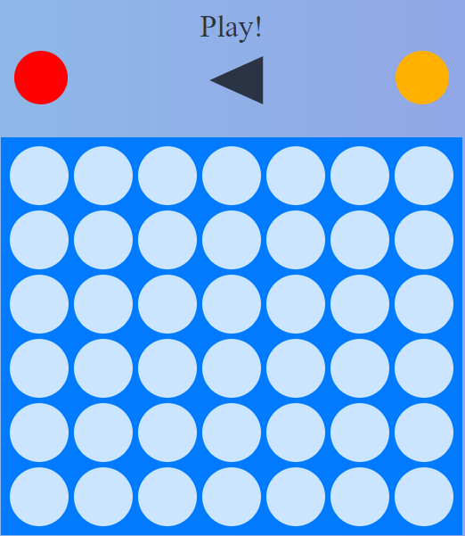

# Four in a Line Game

  This React application implements the classic game of Four in a Line. The game allows two players to take turns placing colored discs on a grid in an attempt to form a line of four discs of their color horizontally, vertically, or diagonally.

  

## Live Demo

You can see the game running online at [https://four-inline-game.netlify.app/](https://four-inline-game.netlify.app/)

## Table of Contents
- [Description](#description)
- [Components](#components)
  - [GameComponent](#gamecomponent)
  - [WinnerComponent](#winnercomponent)
  - [TableComponent](#tablecomponent)
  - [HeaderComponent](#headercomponent)
  - [HomeComponent](#homecomponent)
- [Usage](#usage)
- [Dependencies](#dependencies)

## Description

The application consists of several React components:

### GameComponent

- Description: The main component that manages the game state, including the game board and current player turn.
- Responsibilities:
  - Manages the game board state.
  - Handles player turns and disc placement.
  - Renders the Header, Winner, and Table components.

### WinnerComponent

- Description: Component responsible for determining if there is a winner and displaying the winning message.
- Responsibilities:
  - Checks the game board for winning sequences.
  - Displays the winner and provides options to play again or return to the home page.

### TableComponent

- Description: Renders the game board grid.
- Responsibilities:
  - Renders the grid based on the current state of the game board.
  - Handles click events for disc placement.

### HeaderComponent

- Description: Displays the current player's turn.
- Responsibilities:
  - Renders player turn indicators.
  - Indicates which player's turn it is to place a disc.

### HomeComponent

- Description: Home page component displaying game options.
- Responsibilities:
  - Displays options to play the game locally or against the computer.

## Usage

1. Clone the repository.
2. Install dependencies using `npm install`.
3. Run the application using `npm start`.
4. Choose an option on the home page to play the game.
5. Place discs on the game board by clicking on the desired column.

## Dependencies

- React
- react-router-dom
